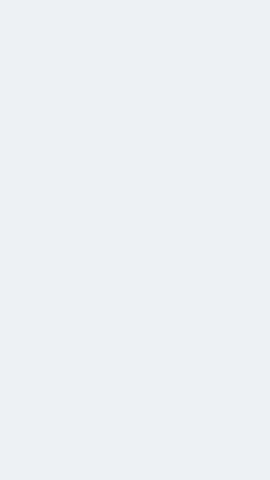

# Effects

Say the name to your agent, it copies the file from `effects/src/effects/` into your project.

|   |   |   |   |
|:---:|:---:|:---:|:---:|
|  `WordPop` Words pop in on their cue frame |  `ScriptWord` Huge handwriting word that writes itself on |  `ClipInset` Rounded clip card with slow zoom |  `AmbientCard` Clip card with a soft glow behind |
|  `Counter` Big number racing upward |  `SquiggleArrow` Hand-drawn looping arrow pointing at something |  `MapRoute` Outline map, arc from city A to B |  `LogoCard` Logo laid down like a card |
|  `NameCard` Photo card with name and lead-in |  `CrowdWall` Zoom out on a crowd, a few light up |  `PhotoCollage` Wall of photo tiles dropping in |  `GrowthCards` Dashboard cards with charts growing up |
|  `PathRun` Dot runs a path past markers, tracked |   |   |   |

| Name | File in `effects/src/effects/` | Main props |
|---|---|---|
| `WordPop` | `WordPop.tsx` | `words[]` (`text`, `at`, `font`, `size`, `x`, `y`), `color`, `shadow` |
| `ScriptWord` | `ScriptWord.tsx` | `text`, `at`, `size`, `x`, `y`, `color`, `reveal` |
| `ClipInset` | `ClipInset.tsx` | `children`, `at`, `top`, `width`, `zoomTo`, `zoomOrigin` |
| `AmbientCard` | `AmbientCard.tsx` | `children`, `at`, `top`, `width`, `zoomTo`, `glow` |
| `Counter` | `Counter.tsx` | `to`, `from`, `at`, `frames`, `prefix`, `suffix`, `color`, `size` |
| `SquiggleArrow` | `SquiggleArrow.tsx` | `from`, `to`, `at`, `frames`, `color`, `loop`, `side` |
| `MapRoute` | `MapRoute.tsx` | `outline`, `from`, `to`, `timing`, `zoomTo`, `color` |
| `LogoCard` | `LogoCard.tsx` | `children`, `at`, `width`, `card`, `shine` |
| `NameCard` | `NameCard.tsx` | `children`, `lead`, `name`, `also`, `at`, `cues` |
| `CrowdWall` | `CrowdWall.tsx` | `highlights`, `zoomFrames`, `zoomFrom`, `highlightAt`, `dimTo` |
| `PhotoCollage` | `PhotoCollage.tsx` | `tiles`, `at`, `area`, `cols`, `stagger` |
| `GrowthCards` | `GrowthCards.tsx` | `at`, `titles`, `rows`, `top` |
| `PathRun` | `PathRun.tsx` | `waypoints`, `markers`, `lane`, `label`, `title`, `frames` |

Effects that show text also need `effects/src/lib/fonts.ts` (Inter, Playfair Display italic, Pinyon Script).

Preview: `cd effects && npm install && npm run dev`, then pick an effect in the studio sidebar.  
Rebuild the GIFs after a change: `npm run gifs` in `effects/` (needs ffmpeg).
