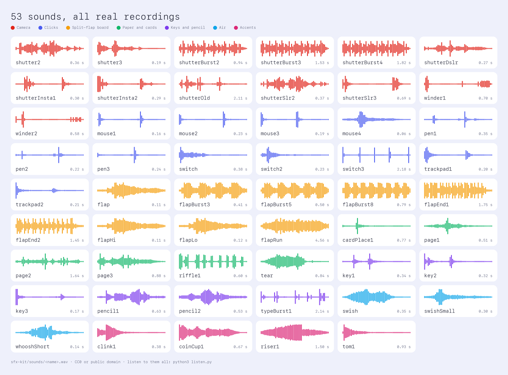
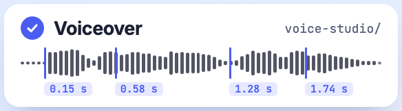
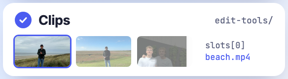
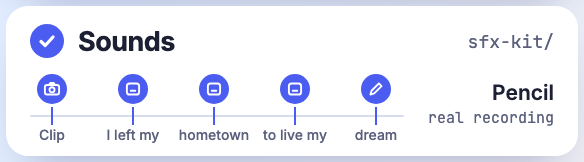
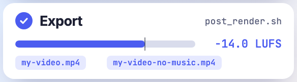
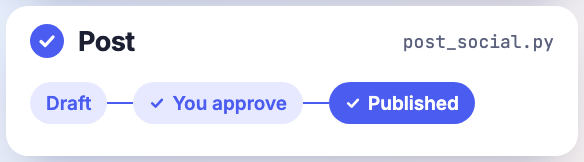

# shortform-edit-kit

**Build short vertical videos by talking to your AI agent.** You say what you want and record your script. The agent cuts, adds sound, exports and posts.

[](docs/flow.mp4)

<p align="center">▶ <a href="docs/flow.mp4"><b>Watch with sound</b></a> (32 s)</p>

## Install

Paste this to your agent (Claude Code, Codex, Hermes):

```text
Clone https://github.com/JasperKallfelz/shortform-edit-kit, read AGENTS.md and docs/setup.md and set the kit up. Check the prerequisites, install the example project, start Remotion Studio and tell me what is still missing (microphone, whisper model, accounts for posting).
```

## A real video made with it

<table>
<tr>
<td width="230"><a href="docs/real-example.mp4"></a></td>
<td>
<b>16 seconds, built with exactly these tools.</b><br><br>
Voiceover recorded in the browser.<br>
Text pops on every spoken word.<br>
Clips dropped into slots.<br>
Every movement has a real sound.<br><br>
▶ <a href="docs/real-example.mp4">Watch with sound</a> (shown without music)
</td>
</tr>
</table>

## Effects

Say the name, the agent puts it in.

<table>
<tr><td align="center"><a href="EFFECTS.md"></a><br><code>WordPop</code></td><td align="center"><a href="EFFECTS.md"></a><br><code>ScriptWord</code></td><td align="center"><a href="EFFECTS.md"></a><br><code>MapRoute</code></td><td align="center"><a href="EFFECTS.md"></a><br><code>CrowdWall</code></td></tr>
<tr><td align="center"><a href="EFFECTS.md"></a><br><code>PhotoCollage</code></td><td align="center"><a href="EFFECTS.md"></a><br><code>GrowthCards</code></td><td align="center"><a href="EFFECTS.md"></a><br><code>SquiggleArrow</code></td><td align="center"><a href="EFFECTS.md"></a><br><code>PathRun</code></td></tr>
</table>

8 of 13 shown. All of them, with their props: **[EFFECTS.md](EFFECTS.md)**

## Sounds

53 real recordings, no synthetic clicks. Hear them all with `python3 listen.py`.

[](sfx-kit/README.md)

## How it works

<table>
<tr><td width="56%"></td><td><b>1 · Speak.</b> Read your script from the teleprompter. Every word gets a time.</td></tr>
<tr><td></td><td><b>2 · Clips.</b> Name a clip. It lands in a slot.</td></tr>
<tr><td></td><td><b>3 · Sounds.</b> Each sound hangs on a word. Re-record and they all move with it.</td></tr>
<tr><td></td><td><b>4 · Export.</b> Loudness checked, with and without music.</td></tr>
<tr><td></td><td><b>5 · Post.</b> Nothing goes public until you approve.</td></tr>
</table>

All commands, step by step: [`docs/manual.md`](docs/manual.md). For agents: [`AGENTS.md`](AGENTS.md).

<details>
<summary><b>Configuration</b></summary>

| What | Where | What for | Required? |
|---|---|---|---|
| `VOICE_STUDIO_MODELS` | environment variable | paths of the whisper models (`ggml-*.bin`), comma-separated | for `npm run vo` |
| `WHISPER_CLI` | environment variable | path to `whisper-cli` if it is not on your `PATH` | no |
| `script.json` | `example/` | the spoken text, its language and the keys of the word timings | for a new video |
| Props `slots`, `music`, `voiceover`, `sfxVolume` | Remotion Studio, `example/src/Demo.tsx` | clips, music, voiceover, volume of the effects | no |
| `edit-tools/post.config.json` | file, template `post.config.example.json` | account ids for posting; never committed | only for posting |
| `EDIT_HOST` | environment variable | SSH name of the machine `post_render.sh` renders on | for the export |
| `VOICE_STUDIO_PORT`, `LISTEN_PORT` | environment variable | ports of the recorder page (3600) and the listening page (3700) | no |
| `LISTEN_STATE` | environment variable | file in which the listening page keeps your picks (`selection.json`) | no |

Every setting: [`docs/setup.md`](docs/setup.md#3-configuration-reference).

</details>

<details>
<summary><b>What is inside</b></summary>

| Path | Content |
|---|---|
| `AGENTS.md` | entry point for an AI agent that builds or changes a video with the kit: folder map, the five steps as a checklist, house rules |
| `EFFECTS.md`, `effects/` | every visual effect by name with an animated preview; one file per effect to copy into your project |
| `voice-studio/` | voiceover: record in the browser (teleprompter), master, measure the word timings and write the timing table `src/timing.ts`. Runs entirely on your machine |
| `example/` | Remotion example without personal material: text that pops on the spoken word, clip card with zoom (also with an ambient-light glow), drawn arrow, running number, sound track, plus `script.json` for the Voice Studio. `demo.mp4` shows the result |
| `sfx-kit/` | 53 prepared sound effects (real recordings), a catalogue with length, cue point and loudness, scripts to prepare sounds and to put them into a Remotion project |
| `sfx-candidates/` | 233 raw candidates with source and licence per file (`manifest.tsv`) |
| `listen.py`, `index.html` | listening page in the browser: hear every sound, keep or drop, keyboard only if you like |
| `edit-tools/` | scripts: fetch videos from WhatsApp, contact sheet, safe file edits, final export with loudness check, posting to TikTok and Instagram (`post_social.py`). The README there describes the steps, `POSTING.md` the posting |
| `skills/` | two skills for agents (Hermes format, also usable as instructions for Claude Code) |
| `flow-film/` | Remotion project that builds the film at the top (`docs/flow.mp4`, `docs/flow.gif`) |
| `tour/` | Remotion project for a recorded tour of the tools (`docs/tour.mp4`; it still shows the earlier German interface and will be re-recorded) |
| `docs/` | setup and configuration (`setup.md`), all commands (`manual.md`), what research says about retention, captions, hashtags and music rights (`research-2026-10.md`), what we learned building videos (`shortform-learnings-2026-10.md`, `sound-and-text-sync.md`) |

</details>

<details>
<summary><b>The principles behind it</b></summary>

- **Everything hangs on word timings.** Picture, text and sounds take their cues from a table of the voiceover's word timings (`src/timing.ts`, written by the Voice Studio). A new take moves everything together. That makes variants of a video cheap.
- **Only real, recorded sounds.** Shutter, mouse click, split-flap board, paper, pencil, keys. No synthetic UI packs. Every movement gets a small sound, quiet enough not to sound pasted in.
- **Look and measure first, then say "done".** Render a single frame and look at it, render the effects-only track and compare levels, check the loudness of the export, read the published post back.
- **The tools stop rather than guess.** The Voice Studio gives no timings when the word count does not match; the posting script creates nothing public without `--publish`.
- **The human approves.** Agents propose and build; a post goes out only after the caption and the publication were approved explicitly.

</details>

<details>
<summary><b>What research says</b></summary>

Summary of [`docs/research-2026-10.md`](docs/research-2026-10.md) (as of 8 Oct 2026, with the strength of evidence per claim; check the source yourself before quoting a figure):

- The first 1.5 to 3 seconds decide: start with the strongest picture, set one clear peak, show the face early, put text in the picture. Turning up saturation does nothing according to the evidence.
- Caption and hashtags matter little next to watch time and shares. Instagram has allowed at most 5 hashtags since December 2025; 3 to 4 fitting ones are enough for TikTok.
- Music: upload the version without music and add the song in the app from the platform's own library.
- Variants and test reels: change one thing per round, the first 1.5 seconds first, and wait at least 72 hours.

</details>

<details>
<summary><b>What is deliberately missing</b></summary>

Recordings, music and everything account-specific (account ids, configuration, logs). Music does not belong in the repo; see [`docs/research-2026-10.md`](docs/research-2026-10.md) on music rights when posting. Which files are never committed is listed in [`AGENTS.md`](AGENTS.md).

</details>

## Licences and thanks

The sounds are CC0 or public domain; details and sources in [`SOUND-LICENSES.md`](SOUND-LICENSES.md).
Additional sounds: Joseph SARDIN – [BigSoundBank.com](https://BigSoundBank.com).
No licence has been chosen yet for code and texts.
