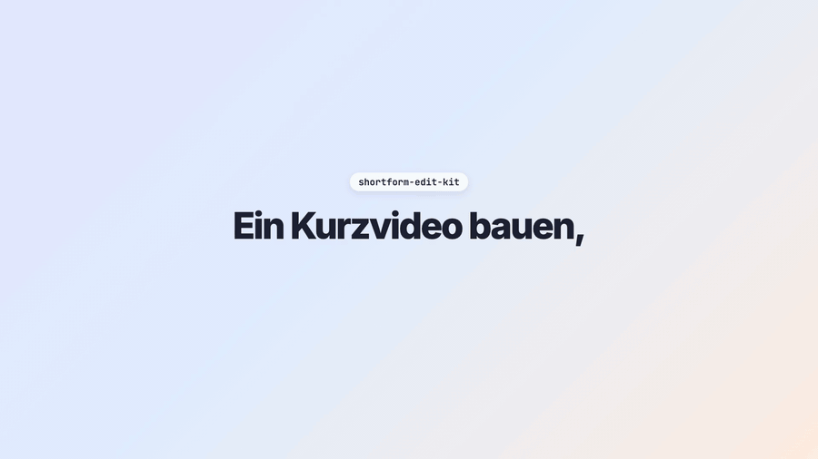
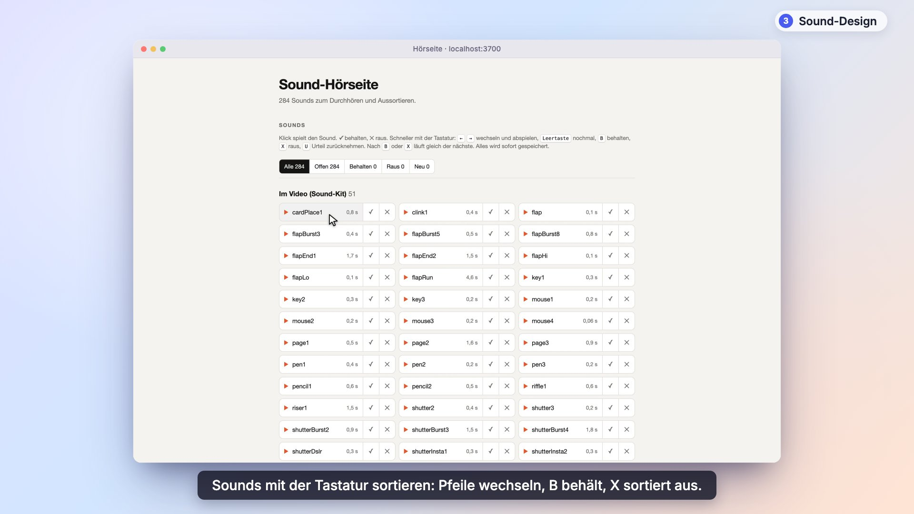

# shortform-edit-kit

Du sagst einem KI-Agenten (Claude Code, Codex, Hermes), was für ein Kurzvideo du willst, und sprichst dein Skript ein. Der Agent baut daraus das Video mit [Remotion](https://www.remotion.dev): Text im Sprechtakt, deine Clips, Sound-Effekte aus echten Aufnahmen, den Export mit geprüfter Lautheit und, nach deiner Freigabe, den Post.

*English in one line: a voiceover studio, tools, 233 CC0 sound-effect candidates (53 prepared), agent skills, a posting script and a Remotion demo for short vertical videos. Docs are in German.*

[](docs/ablauf.mp4)

▶ Klick aufs Bild spielt den Film mit Ton (32 Sekunden).

## So funktioniert es

1. Du sprichst dein Skript im Browser-Tonstudio ein, mit Teleprompter; alles bleibt auf deinem Rechner.
2. Der Agent misst, wann jedes Wort fällt, und schreibt die Zeit-Tabelle `src/timing.ts`; Bild, Text und Sounds hängen an diesen Zeiten.
3. Deine Clips kommen in Slots, die sich im Remotion Studio verschieben lassen, ohne Code anzufassen.
4. Sound-Effekte aus echten Aufnahmen hängen an Wörtern und Bewegungen im Bild, nie lauter als die Musik.
5. Der Export prüft die Lautheit; gepostet wird erst, wenn du Beschreibung und Veröffentlichung freigibst.

## Installieren

Gib deinem Agenten das hier:

```text
Klone https://github.com/JasperKallfelz/shortform-edit-kit, lies AGENTS.md und docs/einrichtung.md und richte das Kit ein. Prüfe die Voraussetzungen, installiere das Beispielprojekt, starte das Remotion Studio und sag mir, was noch fehlt (Mikrofon, whisper-Modell, Konten zum Posten).
```

Wer es lieber selbst einrichtet, findet dieselben Schritte in [`docs/einrichtung.md`](docs/einrichtung.md).

## Mehr Videos

| Ein echtes Video aus dem Kit (16 s) | Rundgang durch die Werkzeuge (80 s) | Die Vorlage im Repo (9 s) |
|:---:|:---:|:---:|
| [](docs/real-example.mp4) | [](docs/rundgang.mp4) | [](beispiel/demo.mp4) |
| Mit diesen Werkzeugen gebaut und so gepostet; hier ohne Musik | Tonstudio, Remotion Studio, Hörseite und Terminal in echt | Dieselben Bausteine ohne eigenes Material |

## Konfiguration

| Was | Wo | Wofür | Pflicht? |
|---|---|---|---|
| `TONSTUDIO_MODELLE` | Umgebungsvariable | Pfade der Whisper-Modelle (`ggml-*.bin`), durch Komma getrennt | für `npm run vo` |
| `WHISPER_CLI` | Umgebungsvariable | Pfad zu `whisper-cli`, falls es nicht im `PATH` liegt | nein |
| `skript.json` | `beispiel/` | gesprochener Text, Sprache und Schlüssel der Wortzeiten | für ein neues Video |
| Props: `slots`, `music`, `voiceover`, `sfxVolume` | Remotion Studio, `beispiel/src/Demo.tsx` | Clips, Musik, Voiceover, Lautstärke der Effekte | nein |
| `edit-tools/post.config.json` | Datei, Vorlage `post.config.example.json` | Konto-IDs zum Posten; wird nie eingecheckt | nur zum Posten |
| `EDIT_HOST` | Umgebungsvariable | SSH-Name des Rechners, auf dem `post_render.sh` rendert | für den Export |
| `TONSTUDIO_PORT`, `HOERSEITE_PORT` | Umgebungsvariable | Ports der Aufnahme-Seite (3600) und der Hörseite (3700) | nein |
| `HOERSEITE_STATE` | Umgebungsvariable | Datei, in der die Hörseite die Urteile ablegt (`auswahl.json`) | nein |

Alle Stellschrauben mit Fundstelle im Code: [`docs/einrichtung.md`](docs/einrichtung.md#3-konfigurations-referenz).

<details>
<summary>Was drin ist</summary>

| Pfad | Inhalt |
|---|---|
| `AGENTS.md` | Einstieg für einen KI-Agenten, der mit dem Kit ein Video baut oder ändert: Ordnerkarte, fünf Schritte als Checkliste, Hausregeln |
| `tonstudio/` | Voiceover: im Browser aufnehmen (Teleprompter), aufbereiten, Wortzeiten messen und die Zeit-Tabelle `src/timing.ts` erzeugen. Läuft ganz lokal |
| `beispiel/` | Remotion-Demo ohne eigenes Material: Text, der zum Sprechtakt aufpoppt, Clip-Karte mit Zoom (auch mit Ambient-Light-Schein), gezeichneter Pfeil, laufende Zahl, Sound-Spur, Prüf-Overlay für die Freihalte-Bereiche von Instagram und TikTok, dazu `skript.json` für das Tonstudio. `demo.mp4` zeigt das Ergebnis |
| `sfx-kit/` | 53 aufbereitete Sound-Effekte (echte Aufnahmen), Katalog mit Länge, Einsatzpunkt und Lautheit, Skripte zum Aufbereiten und zum Einspielen in ein Remotion-Projekt |
| `sfx-kandidaten/` | 233 rohe Kandidaten mit Quelle und Lizenz je Datei (`manifest.tsv`) |
| `hoerseite.py`, `index.html` | Hörseite im Browser: alle Sounds durchhören, behalten oder aussortieren, auch nur mit der Tastatur |
| `edit-tools/` | Skripte: Videos aus WhatsApp holen, Kontaktbogen, Dateien sicher ändern, fertiger Export mit Lautheitsprüfung, Posten auf TikTok und Instagram (`post_social.py`). Das README dort beschreibt die Abläufe, `POSTEN.md` das Posten |
| `skills/` | Zwei Skills für Agenten (Hermes-Format, als Anleitung auch für Claude Code brauchbar) |
| `ablauf-film/` | Remotion-Projekt, das den Film oben baut (`docs/ablauf.mp4` und die stumme Vorschau `docs/ablauf.gif`): gezeichnete Animation, Ton nur aus dem Sound-Kit |
| `rundgang/` | Remotion-Projekt, das `docs/rundgang.mp4` baut (echte Aufnahmen der Werkzeuge, nachgebautes Terminal) |
| `docs/` | Handbuch (`handbuch.md`), Einrichtung und Konfiguration (`einrichtung.md`), was die Forschung zu Zuschauerbindung, Beschreibung, Hashtags und Musikrechten sagt, mit Quellen; die Erfahrungen aus dem Bauen: Skript vor Schnitt, Stimme, Raumklänge, Bildbausteine, Formate kleiner Konten ([`kurzvideo-erfahrungen-2026-10.md`](docs/kurzvideo-erfahrungen-2026-10.md)); dazu die Filme |

</details>

<details>
<summary>Die Grundsätze dahinter</summary>

- **Alles hängt an Wortzeiten.** Bild, Text und Sounds beziehen ihre Einsätze aus einer Tabelle mit den Wortzeiten des
  Voiceovers (`src/timing.ts`, vom Tonstudio erzeugt). Ein neuer Take verschiebt alles gemeinsam. So werden Varianten eines
  Videos billig.
- **Nur echte, aufgenommene Geräusche.** Auslöser, Mausklick, Klapptafel, Papier, Bleistift, Tasten. Keine synthetischen
  UI-Pakete. Jede Bewegung bekommt einen kleinen Sound, leise genug, dass er nicht eingefügt klingt.
- **Erst ansehen und messen, dann „fertig“ sagen.** Einzelbild rendern und anschauen, Nur-Effekte-Spur rendern und Pegel
  vergleichen, Lautheit des Exports prüfen, den veröffentlichten Beitrag zurücklesen.
- **Die Werkzeuge brechen lieber ab, als zu raten.** Das Tonstudio liefert keine Zeiten, wenn die Wortzahl nicht stimmt; das
  Post-Skript legt ohne `--publish` nichts Öffentliches an.
- **Der Mensch gibt frei.** Agenten schlagen vor und bauen; gepostet wird erst nach ausdrücklicher Freigabe der Beschreibung und
  der Veröffentlichung.

</details>

<details>
<summary>Was die Forschung dazu sagt</summary>

Zusammenfassung von [`docs/recherche-2026-10.md`](docs/recherche-2026-10.md) (Stand 08.10.2026, mit Beleglage je Aussage; vor dem
Zitieren einer Zahl die Quelle selbst prüfen):

- Die ersten 1,5 bis 3 Sekunden entscheiden: mit dem stärksten Bild beginnen, einen klaren Höhepunkt setzen, das Gesicht früh zeigen,
  Text im Bild. Sättigung hochdrehen bringt nach Beleglage nichts.
- Beschreibung und Hashtags sind Nebensache gegenüber Sehdauer und Weiterleitungen. Instagram erlaubt seit Dezember 2025 höchstens 5
  Hashtags, für TikTok reichen 3 bis 4 passende.
- Musik: Die Fassung ohne Musik hochladen und den Song in der App aus der Bibliothek der Plattform dazulegen.
- Varianten und Test-Reels: je Runde nur eine Sache ändern, zuerst die ersten 1,5 Sekunden, und mindestens 72 Stunden warten.

</details>

<details>
<summary>Was bewusst fehlt</summary>

Eigenes Videomaterial, Aufnahmen und Voiceover, Musik und alles Kontospezifische (Konten-IDs, Konfiguration, Protokolle). Musik
gehört nicht ins Repo; siehe [`docs/recherche-2026-10.md`](docs/recherche-2026-10.md) zu Musikrechten beim Posten. Welche Dateien nie
eingecheckt werden, steht in [`AGENTS.md`](AGENTS.md).

</details>

**Alle Befehle Schritt für Schritt:** [`docs/handbuch.md`](docs/handbuch.md)

**Für KI-Agenten:** Einstieg, Regeln und die Checkliste stehen in [`AGENTS.md`](AGENTS.md).

## Lizenzen und Dank

Die Sounds sind CC0 bzw. gemeinfrei, Details und Quellen in [`SOUNDS-LIZENZEN.md`](SOUNDS-LIZENZEN.md).
Additional sounds: Joseph SARDIN – [BigSoundBank.com](https://BigSoundBank.com).
Für Code und Texte ist noch keine Lizenz festgelegt.
